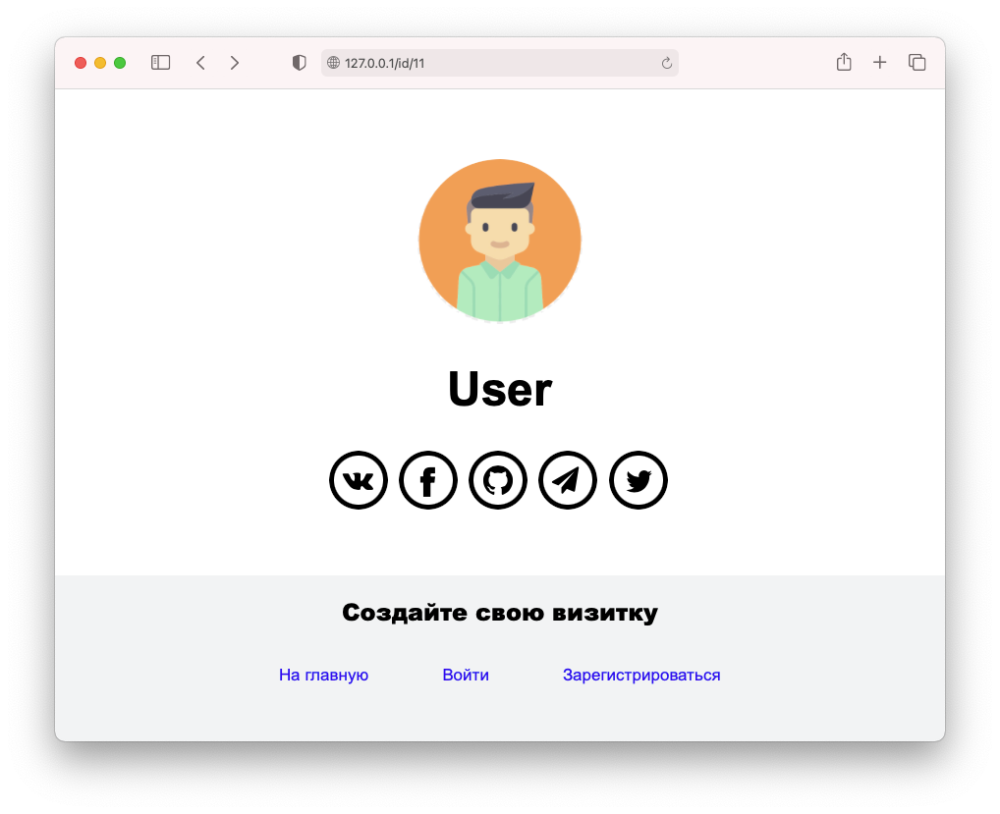

# urpage &ndash; a simple site with links on social media



### Installation
* install [Golang](https://golang.org/) 
* set environment variables: 

var            |   example
---------------|---------------
DB_ADDRESS     | localhost:5432
DB_USERNAME    | postgres
DB_NAME        | site_db
DB_PASSWORD    | P@SSW0RD
REDIS_ADDRESS  | localhost:6379
REDIS_PASSWORD | P@SSW0RD


* install [PostgreSQL](https://www.postgresql.org/) and create a table in your database:
 
```
CREATE TABLE user_info (
    user_id SERIAL PRIMARY KEY NOT NULL, 
    username TEXT NOT NULL, 
    password TEXT NOT NULL, 
    email TEXT NOT NULL, 
    create_date DATE NOT NULL,
    image_path TEXT, 
    links TEXT
);
```

* install and run [redis](https://redis.io/)

### Usage
run command `go build .` in directory with a project and go to `localhost:8080` in your browser